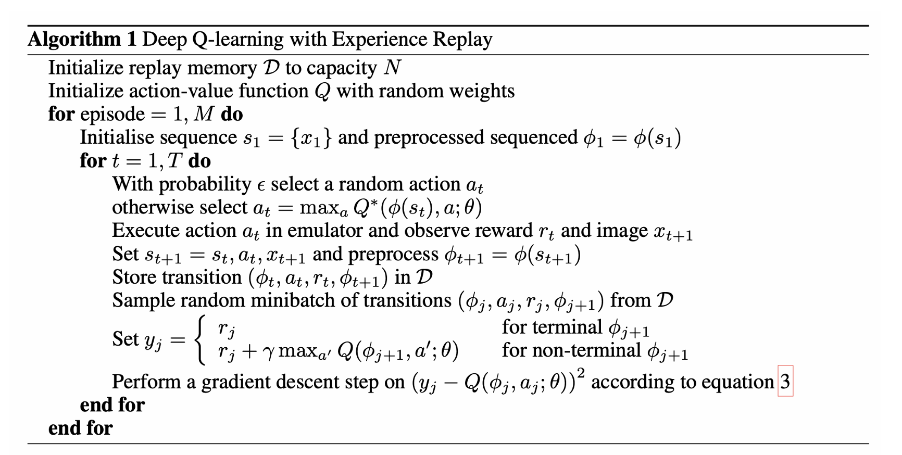
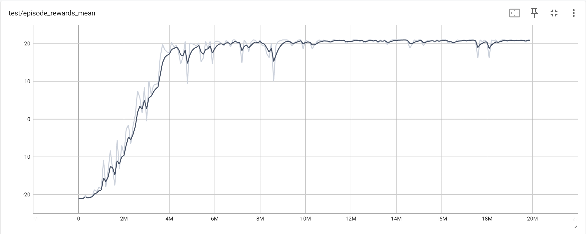
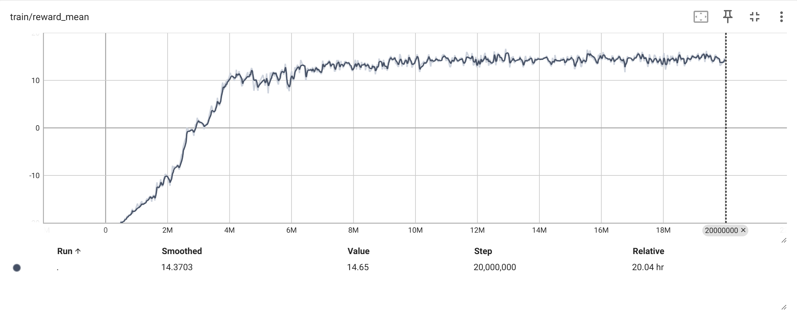
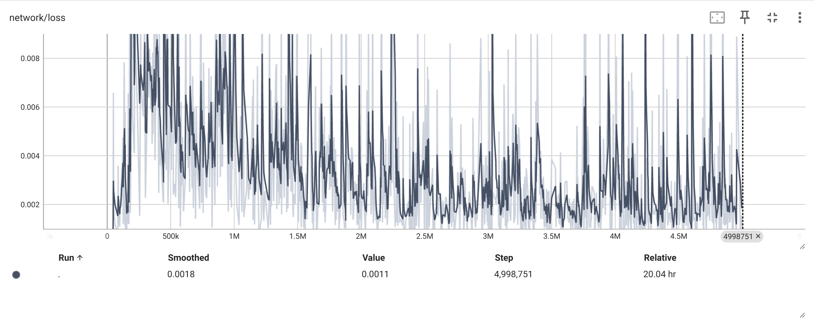
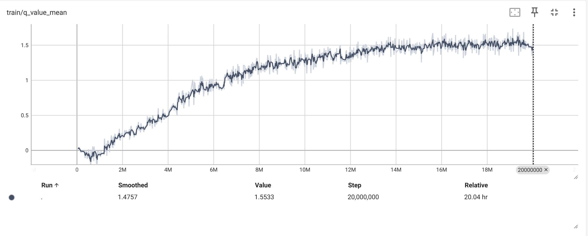
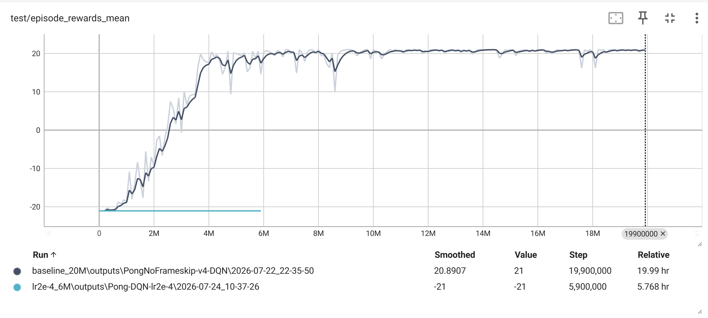
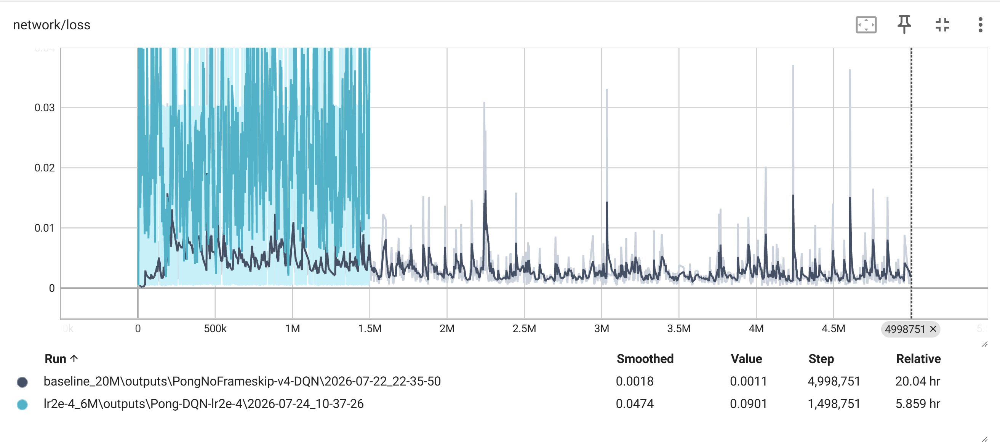
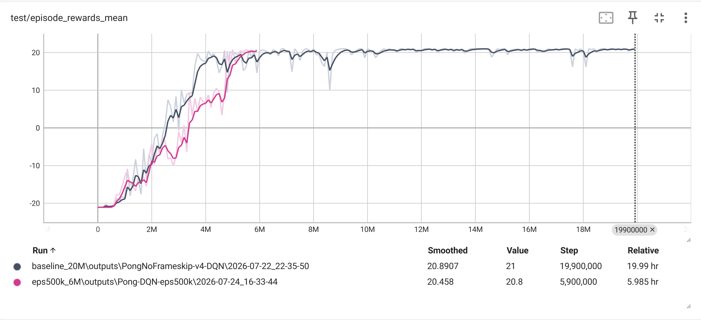
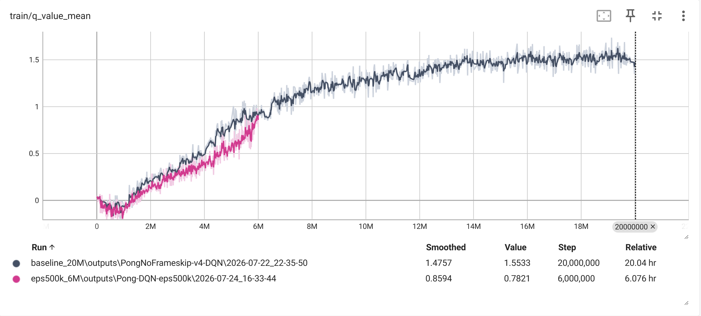
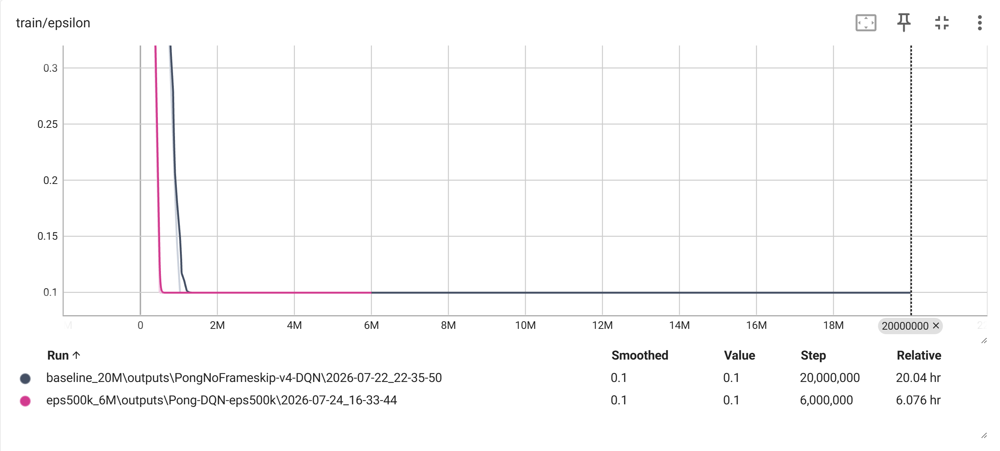

# DQN 实验报告

## 1. 实验目的

本实验是对DQN算法的复现，采用了论文“Playing Atari with Deep Reinforcement Learning”中的网络架构并成功使得agent在Pong游戏中的表现达到人类水平。

---

## 2. DQN 算法与实现

### 2.1 DQN 网络结构

| Layer | Input Shape | Output Shape |
|---|---|---|
| 卷积层1 |(batch size,4,84,84) |(batch size,16,20,20) | 
| 卷积层2 |(batch size,16,20,20) |(batch size,32,9,9) | 
| 线性层1 |(batch size,2592) |(batch size,256) | 
| 输出层 |(batch size,256) |(batch size,num_actions) | 

### 2.2 DQN 算法

---

## 3. 实验参数设置

###  Baseline Parameters

| Parameter | Value |
|---|---:|
| Learning Rate |1e-4 |
| Gamma |0.99 |
| Batch Size |32 |
| Replay Buffer Size |1e6 |
| Initial Epsilon |1 |
| Final Epsilon |0.1 |
| Epsilon Decay Steps |1e6 |
| Target Update Interval |1e4 |

---

## 4. Pong Baseline 实验

### 4.1 实验参数

采用原始参数设置。

### 4.2 实验结果

#### Test Reward

**Figure 1.** Baseline Test Reward
**横轴是于环境交互次数，纵轴是测试得分，从2M到4M阶段得分上升最为迅速，在6M之后，得分基本稳定在21**

#### Training Reward

**Figure 2.** Baseline Training Reward
**基本变化趋势与Figure 1相同，6M之后基本稳定在14分，比测试得分低是由于训练后期仍然采用epsilon-greedy策略，部分action随机选择用于exploration**

#### Training Loss

**Figure 3.** Baseline Loss
**训练损失从0开始在与环境交互300k次之前剧烈上升，后续缓慢下降，到2.5M次之后基本稳定在0.002，同时下降过程中还频繁有剧烈的 spike**

#### Q-value

**Figure 4.** Baseline Q Value
**12M次前持续缓慢增长，14M次之后 Q-value 基本稳定在1.5**

### 4.3 结果分析

- reward 最初都是负值，在与环境交互2M到4M时开始迅速提高，在6M后，test reward基本稳定在21分左右，达到论文中的要求，由此可以计算出，在网络更新0.5M到1M次时，开始明显学习；
- Training loss从0开始变化显然不是因为刚开始模型已经学的非常好了，应该是由于程序规定在与环境交互次数大于5k次后才开始模型更新，而此时随机初始化的Q函数与 TD target 的差异过大，造成了 loss 的突然激增。后续过程持续产生spikes,一个显然的原因是 target network 采用的是 hard update ，因此 target 会突然发生变化，loss 就可能发生突变，第二个可能的原因是每次从 Replay Buffer 中抽取的 minibatch 是随机的，可能突然抽到此网络预测的比较差的 transition 导致了 loss 的突然变化；
- Q-value 曲线相较于 reward 曲线更为平缓，主要原因可能是不同 actions 之间 Q-value 值非常小的差异可能会造成 greedy policy 选择的不同，进而导致 reward 较大的差异；

---

## 5. 调参实验

### 5.1 Learning Rate

#### 5.1.1 实验参数

| Experiment | Learning Rate | Other Settings |
|---|---:|---|
| Baseline |1e-4 | unchanged | 
| Experiment |2e-4 | unchanged  |

#### 5.1.2 实验结果

##### Test reward

**Figure 5.**  Test reward comparison
**可以观察到的是，在前6M次与环境交互的过程中，模型几乎没有任何学习，始终保持在-21的初始水平**
##### Training Loss

**Figure 6.**  Training Loss comparison
**此实验相较于 baseline training loss 显著提高，并且产生 spikes 要显著多于 baseline**

#### 5.1.3 结果分析

- lr从1e-4调整至2e-4，就导致了模型几乎没进行有效学习，而普通神经网络由于标签是固定的，学习率大一点可能只是震荡，而 DQN 可能会产生本实验类似糟糕的训练结果。与普通神经网络类似，偏大的学习率可能会导致参数进行较大的更新，进而使得大量其他 (s,a) 对应的 Q-value 一起改变，而这点在 DQN 中会产生严重的后果：在 DQN 中，我们更关心的是 Q 的相对值而非相对值，这是由于我们进行 greedy policy 选择时只是在选择 Q 值最高的动作作为最优策略，所以策略的好坏极大程度上依赖于 Q 值的排序，而前面所说的参数较大程度的更新就有可能会打乱这种排序，使得模型几乎没有进行有效的策略迭代；
- loss 剧烈震荡可能原因是，较大学习率导致 online network 更新幅度更大，这本身就可能导致 Q 的预测值震荡，在加上上述导致 baseline 产生 spikes 的原因，进一步加剧了此实验 training loss 的震荡程度以及 TD error 值，同时 MSE 放大了 error，所以使得此实验 loss 平均值也较高；

---

### 5.2 Epsilon Decay

#### 5.2.1 实验参数

| Experiment | Epsilon Decay Steps | Other Settings | 
|---|---:|---|
| Baseline |1e6 | unchanged | 
| Experiment |0.5e6 | unchanged |

#### 5.2.2 实验结果

##### Test Reward

**Figure 7.**  Test Reward comparison
**test reward 整体趋势与 baseline 类似，在2M到4M次之间略低于   baseline ，但在6M之后与 baseline 达到的值大致相同**

##### Q-value

**Figure 8.**  Q-value
**整体趋势与 baseline 类似，但在2M到6M阶段略低于 baseline，后期恢复**

##### epsilon

**Figure 9.** epsilon 
**本实验在0到0.5M阶段 epsilon 由1线性下降到0.1，而 baseline 的epsilon 是由0到1M阶段线性下降**

#### 5.2.3 结果分析

- test reward 和 Q-vlaue 的图像很有一致性，而且它们共同说明：把 epsilon decay 从1M缩短到0.5M，没有破坏最终学习能力，但让早期学习稍微变慢，等网络学到一定程度后，又迅速追上 baseline；
- 本实验 epsilon 降得更快，虽是早期做随机动作更少了，做的更多是 greedy action，但是由于缺少 exploration,部分 (s,a) 缺少经验，使得早期训练的网络不如 baseline 准确，导致了所谓的 greedy action 并不是非常可靠，由此可以得出结论：过早 exploitation 有可能拖慢早期学习；
- 虽然 epsilon decay 降低了，但它始终没有停止探索，所以在6M左右逐渐追上了 baseline。

---

